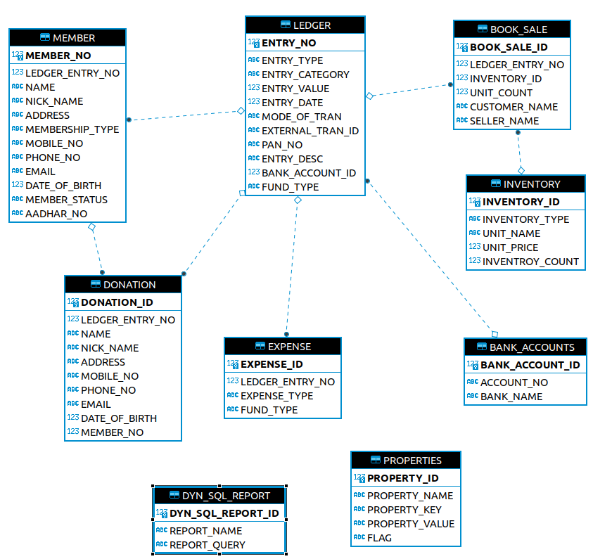

## Design Decisions
1. To save the cost and simplify the design, we will using the Desktop application
1. [Java FX](https://openjfx.io) will be used as UI framework
1. For back-end we will be using the [SQLLite](https://www.sqlite.org/index.html)
1. Primary language will be used for all labels and texts are Kannada. However, we will also allow the user to enter either in English or Kannada language in the field during the usage
1. For persistence for we will be using the [Hibernate](https://hibernate.org/orm/)

## Useful Resources
1. [JavaFx skinning Reference Guide](https://docs.oracle.com/javase/8/javafx/api/javafx/scene/doc-files/cssref.html)

## Development Environment setup
1. Download latest Eclipse editor [Link](https://www.eclipse.org/downloads/packages/release/mars/r/eclipse-ide-java-ee-developers)
1. Download JDK 8 [Link](https://www.oracle.com/java/technologies/javase/javase-jdk8-downloads.html). You can download higher version as well. If you do, we may have manually configure Java FX
	1. Optional - You can install eclipse fx plugin [Link](https://marketplace.eclipse.org/category/free-tagging/javafx)
1. For UI drag and drop, use Scene Builder [Link](https://gluonhq.com/products/scene-builder/)

## Open issues
* SQLLite does not have default dialect for Hibernate. For now we are can go with H2 dialect but it going cause problem soon. We need to move to either H2 or write custom dialect for SQLLite

## Data Model
